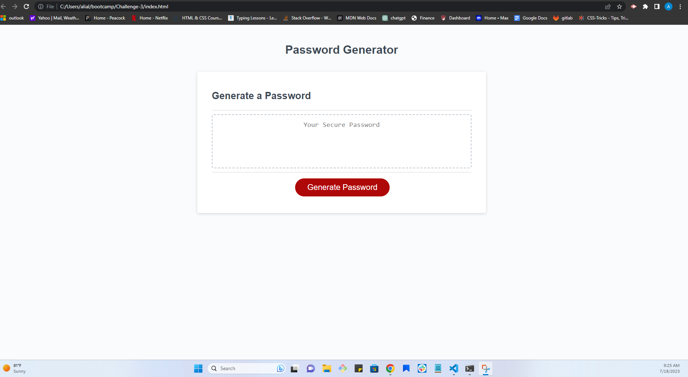

# Challenge-3

## Description
The website is a password generator. User can choose how many characters between a set limit, that they would like their password to be. If the user picks an invalid response here, then they will get an alert that says "Nope" to signify that they have not selected an input within the allowed range. The website then follows this input with four prompts that the user has to decide to accept or decline the prompts. The four prompts are criteria that the user has a choice to include in their password; these criteria being uppercase letters, lowercase letters, numbers, and special characters. Once user answers all prompts, a password will be generated on screen.

## Contributors
https://developer.mozilla.org/en-US/docs/Web/JavaScript/Reference/Global_Objects/Math/random

https://www.w3schools.com/js/js_random.asp

Bootcamp classmates, AskBCS, as well as tutor Juan Delgado

# Links 

Website: https://ali-aldawoodi.github.io/Password-Generator/
